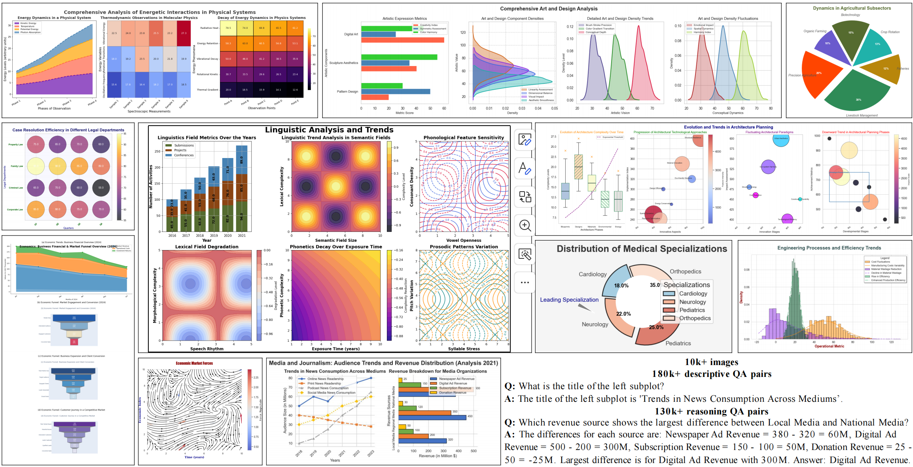

<h1 align="center">
  🔥 Effective Training Data Synthesis for Improving MLLM Chart Understanding
</h1>
<h3 align="center" style="color: blue; font-weight: normal;">
  ICCV 2025 (poster)
</h3>

<p align="center">
  Yuwei Yang<sup>1</sup>, Zeyu Zhang<sup>1</sup>, Yunzhong Hou<sup>1</sup>, Zhuowan Li<sup>4</sup>, Gaowen Liu<sup>3</sup>, Ali Payani<sup>3</sup>, Yuan-Sen Ting<sup>2</sup>, Liang Zheng<sup>1</sup>
</p>

<p align="center">
  <sup>1</sup>Australian National University &emsp;
  <sup>2</sup>Ohio State University &emsp;
  <sup>3</sup>Cisco &emsp;
  <sup>4</sup>Johns Hopkins University
</p>

<p align="center">
  <a href="https://huggingface.co/datasets/ChartFoundation/ECD-10k-Images">🤗 Dataset </a> &ensp;
  <a href="https://huggingface.co/datasets/ChartFoundation/ECDBench">🥇 Benchmark </a> &ensp;
  <a href="https://huggingface.co/ChartFoundation/ECD_Finetuned_MLLMs"> 🧠 Models </a> &ensp;
  <br><br>
</p>



## ✨ Abstract
Being able to effectively read scientific plots, or chart understanding, is a central part toward building effective agents for science. However, existing multimodal large language models (MLLMs), especially open-source ones, are still falling behind with a typical success rate of 30%-50% on challenging benchmarks. Previous studies on fine-tuning MLLMs with synthetic charts are often restricted by their inadequate similarity to the real charts, which could compromise model training and performance on complex real-world charts. In this study, we show that modularizing chart generation and diversifying visual details improves chart understanding capabilities. In particular, we design a five-step data synthesis pipeline, where we separate data and function creation for single plot generation, condition the generation of later subplots on earlier ones for multi-subplot figures, visually diversify the generated figures, filter out low quality data, and finally generate the question-answer (QA) pairs with GPT-4o. 
This approach allows us to streamline the generation of fine-tuning datasets and introduce the effective chart dataset (ECD), which contains 10k+ chart images and 300k+ QA pairs, covering 25 topics and featuring 250+ chart type combinations with high visual complexity. We show that ECD consistently improves the performance of various MLLMs on a range of real-world and synthetic test sets.

## ♻️ Data Generation
The overall data generation pipeline used in our work is open-sourced and available for customization. It includes all necessary components for generating ECD synthetic data tailored to MLLM training and evaluation. For a detailed implementation of the pipeline, please refer to the [README](https://github.com/yuweiyang-anu/ECD/tree/main/data_generation_pipeline/README.md) file in the `data_generation_pipeline` directory. The complete ECD dataset (including chart images, codes and QA pairs) generated using this pipeline is publicly available on [🤗Hugging Face](https://huggingface.co/datasets/ChartFoundation/ECD-10k-Images).


## 🛠️ SFT on MLLMs
### Data Preparation
You should first navigate to the `datasets` directory and follow the instructions in the corresponding [`README.md`](https://github.com/yuweiyang-anu/ECD/tree/main/datasets/README.md) file to download and prepare our ECD dataset in specific format.

### Environment Setup
To set up our environment, you should go to the `supervised_finetuning` directory, and run:

- For LLava-Next-LLama3-8B:
```
cd llava_next-8b
conda env create -f environment.yaml
conda activate llama-factory
cd ..
git clone https://github.com/hiyouga/LLaMA-Factory.git
cd LLaMA-Factory
pip install -e ".[torch,metrics]"
```

- For MiniCPM-V2.6:
```
conda activate llama-factory
pip install transformers==4.47.0 
```

- For Phi-3-Vision：
```
cd phi-3-vision
conda env create -f environment.yaml
conda activate phi3v
pip install flash-attn==2.7.4.post1 --no-build-isolation
```

- For Qwen2.5-VL-7B：
```
cd qwen2_5-vl
conda env create -f environment.yaml
conda activate qwenvl2_5
pip install qwen-vl-utils
pip install flash-attn==2.7.4.post1 --no-build-isolation 
```
Additionally, the `enironment` under the `supervised_finetuning` provide a basic docker enironment, you can use it to build a basic enironment and run the aforementioned setup to acquire the various enironment for different models.

### Model Training
To model training, you should go to the `supervised_finetuning` directory, and run:

- For LLava-Next-LLama3-8B:
```
cd llava_next-8b
conda activate llama-factory
bash ./finetune_lora.sh
```

- For MiniCPM-V2.6:
```
cd minicpm_v2_6
conda activate llama-factory
bash ./finetune_lora.sh
```

- For Phi-3-Vision：
```
cd phi-3-vision
conda activate phi3v
bash ./scripts/finetune.sh
```

- For Qwen2.5-VL-7B：
```
cd qwen2_5-vl
conda activate qwenvl2_5
bash ./scripts/finetune_lora.sh
bash ./scripts/merge_lora.sh
```

**Note**: Before running the previous scripts, you should navigate to the corresponding scripts and configure parameters, like `WANDB_API_KEY`, `HUGGINGFACE_HUB_TOKEN`, `data_path`, `image_folder`, etc. You may also customize your own hyperparameters for model training. The models fine-tuned through ECD are available on [🤗Hugging Face](https://huggingface.co/ChartFoundation/ECD_Finetuned_MLLMs).

## 🏆 Evaluation
### Benchmark Data Preparation
To prepare the benchmark datasets, please first navigate to the `public_benchmarks` directory. For each benchmark—**CharXiv**, **ChartQA**, **ReachQA**, **ChartBench**, **ChartX**, and **ECDBench**—enter its corresponding subdirectory and follow the instructions provided in its `README.md` file. Each README contains the relevant download links and data organization formats required to set up the benchmark properly.

### Model Test 
To evaluate the models, similarly navigate to the `evaluation` directory. For each test set, enter its corresponding subdirectory and configure the necessary parameters (e.g., your_trained_model_path) in the `bash_evaluation.sh` script (also `api_key` parameter in the correspoinding py files). Once configured, you can run the evaluation by executing:

```
bash ./bash_evaluation.sh
```

The inference outputs by MLLMs and GPT-4o-based evaluation results will be saved under the `infer_results` directory of each corresponding test set.

### Our ECDBench
[**ECDBench**](https://huggingface.co/datasets/ChartFoundation/ECDBench) is a high-quality benchmark designed to evaluate the chart understanding capabilities of Multimodal Large Language Models (MLLMs). It contains a diverse set of scientific chart images along with fine-grained question-answer (QA) pairs that test both perception and reasoning.

📊 **Overview**

- **Total chart images**: 1,224  
  - **Single-plot charts**: 364  
  - **Multi-subplot charts**: 860  
    - 457 contain **2 chart types** (e.g., *bar + line*, layouts like (1,2), (3,3), etc.)  
    - 403 contain **3 chart types** (e.g., *bar + pie + scatter*, layouts like (1,3), (3,1))  
- **Average image resolution**: 1378 × 968 pixels
- **Construction**: GPT-4o generated Chart Images & QAs with human refinement
- **Total QA pairs**: 2,448  
  - 1 descriptive + 1 reasoning QA per image  

📅 **Performance Comparison**

| Model              | Reasoning | Descriptive | Average |
|--------------------|-----------|-------------|---------|
| **o4-mini**        | **57.03**     | **77.45**       | **67.24** |
| o3                 | 56.13     | 74.51       | 65.32   |
| Gemini-2.5-Pro     | 44.36     | 76.88       | 60.62   |
| o1                 | 40.52     | 74.18       | 57.35   |
| Claude 4 Sonnet    | 44.20     | 69.36       | 56.78   |
| Claude 3.7 Sonnet  | 43.38     | 69.61       | 56.50   |
| Claude 3.5 Sonnet  | 41.99     | 68.14       | 55.07   |
| GPT-4o             | 35.62     | 70.18       | 52.90   |
| Qwen2.5-VL-72B     | 38.81     | 68.46       | 53.64   |
| GPT-4o-mini        | 24.26     | 57.27       | 40.77   |
| Qwen2.5-VL-32B     | 24.92     | 53.92       | 39.42   |
| Qwen2.5-VL-7B      | 19.04     | 57.35       | 38.19   |
| Random (GPT-4o)    | 4.58      | 1.63        | 3.10    |

🔍 **Performance Comparison Before and After ECD Fine-Tuning**

| Model                    | Reasoning | Descriptive | Average |
|--------------------------|-----------|-------------|---------|
| LLaVA-Next-Llama3-8B     | 4.74      | 17.16       | 10.95   |
| + ECD                    | 16.50     | 46.65       | 31.58   |
| MiniCPM-V2.6             | 15.15     | 39.95       | 27.53   |
| + ECD                    | 18.14     | 52.21       | 35.17   |
| Phi-3-Vision             | 21.65     | 41.18       | 31.41   |
| + ECD                    | 29.49     | 59.31       | 44.40   |
| Qwen2.5-VL-7B            | 19.04     | 57.35       | 38.19   |
| + ECD                    | 35.38     | 66.34       | 50.86   |

## 📜 Citation
If ECD proves beneficial to your research, please consider citing our paper in your work:

```
@inproceedings{yang2025effective,
     title={Effective Training Data Synthesis for Improving MLLM Chart Understanding},
     author={Yang, Yuwei and Zhang, Zeyu and Hou, Yunzhong and Li, Zhuowan and Liu, Gaowen and Payani, Ali and Ting, Yuan-Sen and Zheng, Liang},
     booktitle={Proceedings of the IEEE/CVF International Conference on Computer Vision (ICCV)},
     year={2025}
 }
```

## 💡 Acknowledgement
We would like to sincerely thank [camel-ai](https://github.com/camel-ai/camel) for their framework, [LLaMA-Factory](https://github.com/hiyouga/LLaMA-Factory) and [2U1](https://github.com/2U1?tab=repositories) for their excellent open-source MLLM supervised finetuning codebase.

## ✅ License
This repository is released under MIT License (See LICENSE file for details).
